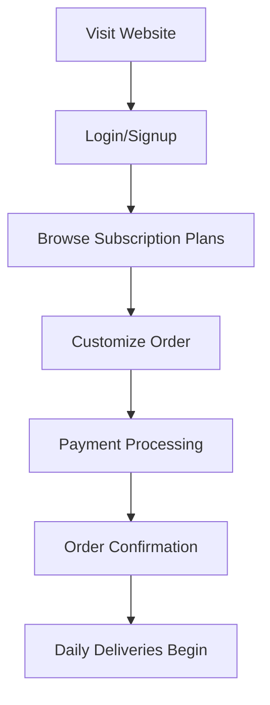
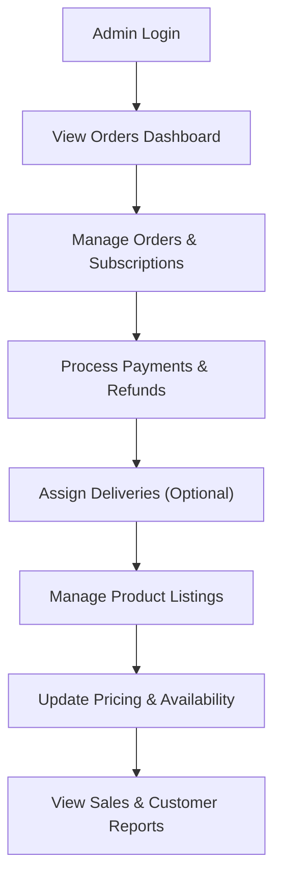

# **Project Brief: The FIT SIP – Subscription-Based E-Commerce Platform**

## **1. Project Overview**

**The FIT SIP** is a health-focused delivery service offering fresh juices, smoothies, and salads to customers in Gurgaon, India. Currently, they manage orders manually via Excel and lack a digital presence. This project aims to build a **subscription-based web and mobile platform** to streamline order management, automate payments, and enhance customer experience.

## **2. Objectives**

- Develop an **e-commerce website** where users can subscribe to daily/weekly/monthly deliveries.
- Implement **automated order tracking and payment processing**.
- Provide an **admin dashboard** for managing orders, customers, and payments.
- Ensure scalability for future **mobile app integration**.

---

## **3. System Architecture**

### **3.1 High-Level Architecture**

The platform consists of three major components:

1. **Customer Interface (Web & Mobile App)** – Users can browse products, subscribe, and manage orders.
2. **Admin Dashboard** – Business owners track orders, manage subscriptions, and handle payments.
3. **Backend & Database** – API-driven backend with a database to store orders, users, and payments.

**Tech Stack:**
| Component | Technology |
|-----------------|-------------|
| Frontend (Web) | Next.js, TailwindCSS |
| Frontend (Mobile) | React Native (Future phase) |
| Backend API | Node.js (Express.js / NestJS) |
| Database | PostgreSQL (Orders, Users, Payments) |
| Cache & Queues | Redis (for caching orders & subscriptions) |
| Authentication | NextAuth.js (Email, OTP, Social Login) |
| Payments | Razorpay / Stripe |
| Notifications | Firebase (Push notifications), Twilio/WhatsApp |
| Admin Panel | Next.js with AdminLTE |
| Deployment | Vercel (Frontend), AWS / DigitalOcean (Backend) |

---

## **4. User Flow & System Interaction**

### **4.1 Customer Flow**



---

### **4.2 Admin Flow**



---

## **5. Features Breakdown**

### **5.1 Customer Features**

✅ **Authentication** (Email, OTP, Google Login)
✅ **Subscription Plans** (Daily, Weekly, Monthly)
✅ **Order Customization** (Add-ons, dietary preferences)
✅ **Payment Gateway** (Razorpay, UPI, Credit/Debit Cards)
✅ **Order History & Tracking**
✅ **Pause/Cancel Subscription**
✅ **Push Notifications & Reminders**
✅ **Referral & Discount Coupons (Future Update)**

### **5.2 Admin Features**

✅ **Order Management** (Daily orders, subscription tracking)
✅ **Customer Management** (User profiles, support requests)
✅ **Payments & Renewals** (Track transactions, refunds)
✅ **Sales Reports & Analytics**
✅ **Delivery Assignment (Optional for scaling)**
✅ **Product Management** (Add/Edit/Delete products, pricing, availability)

---

## **6. Database Schema (Simplified)**

### **6.1 Users Table**

```sql
CREATE TABLE users (
    id SERIAL PRIMARY KEY,
    name VARCHAR(100),
    email VARCHAR(100) UNIQUE,
    phone VARCHAR(15),
    password_hash TEXT,
    email_verified BOOLEAN DEFAULT FALSE,
    account_status VARCHAR(20) DEFAULT 'active',
    last_login TIMESTAMP,
    password_reset_token TEXT,
    password_reset_expires TIMESTAMP,
    created_at TIMESTAMP DEFAULT NOW(),
    updated_at TIMESTAMP DEFAULT NOW()
);
```

### **6.2 User Preferences Table**

```sql
CREATE TABLE user_preferences (
    id SERIAL PRIMARY KEY,
    user_id INT REFERENCES users(id),
    dietary_restrictions TEXT[],
    delivery_preferences JSONB,
    notification_preferences JSONB,
    created_at TIMESTAMP DEFAULT NOW(),
    updated_at TIMESTAMP DEFAULT NOW()
);
```

### **6.3 Delivery Addresses Table**

```sql
CREATE TABLE delivery_addresses (
    id SERIAL PRIMARY KEY,
    user_id INT REFERENCES users(id),
    address_line1 TEXT,
    address_line2 TEXT,
    city VARCHAR(100),
    state VARCHAR(100),
    postal_code VARCHAR(20),
    is_default BOOLEAN DEFAULT FALSE,
    created_at TIMESTAMP DEFAULT NOW(),
    updated_at TIMESTAMP DEFAULT NOW()
);
```

### **6.4 Subscriptions Table**

```sql
CREATE TABLE subscriptions (
    id SERIAL PRIMARY KEY,
    user_id INT REFERENCES users(id),
    delivery_address_id INT REFERENCES delivery_addresses(id),
    plan_type VARCHAR(50), -- Daily, Weekly, Monthly
    start_date DATE,
    end_date DATE,
    status VARCHAR(20) DEFAULT 'active',
    pause_start DATE,
    pause_end DATE,
    created_at TIMESTAMP DEFAULT NOW(),
    updated_at TIMESTAMP DEFAULT NOW()
);
```

### **6.5 Orders Table**

```sql
CREATE TABLE orders (
    id SERIAL PRIMARY KEY,
    user_id INT REFERENCES users(id),
    subscription_id INT REFERENCES subscriptions(id),
    delivery_address_id INT REFERENCES delivery_addresses(id),
    delivery_date DATE,
    delivery_slot VARCHAR(50),
    status VARCHAR(20) DEFAULT 'pending',
    total_amount DECIMAL(10,2),
    payment_status VARCHAR(20),
    created_at TIMESTAMP DEFAULT NOW(),
    updated_at TIMESTAMP DEFAULT NOW()
);
```

### **6.6 Order Items Table**

```sql
CREATE TABLE order_items (
    id SERIAL PRIMARY KEY,
    order_id INT REFERENCES orders(id),
    product_id INT REFERENCES products(id),
    quantity INT,
    unit_price DECIMAL(10,2),
    total_price DECIMAL(10,2),
    special_instructions TEXT,
    created_at TIMESTAMP DEFAULT NOW()
);
```

### **6.7 Payments Table**

```sql
CREATE TABLE payments (
    id SERIAL PRIMARY KEY,
    user_id INT REFERENCES users(id),
    order_id INT REFERENCES orders(id),
    subscription_id INT REFERENCES subscriptions(id),
    amount DECIMAL(10,2),
    payment_status VARCHAR(20),
    payment_method VARCHAR(50),
    transaction_id VARCHAR(100) UNIQUE,
    subscription_period_start DATE,
    subscription_period_end DATE,
    failed_attempts INT DEFAULT 0,
    last_failed_at TIMESTAMP,
    created_at TIMESTAMP DEFAULT NOW(),
    updated_at TIMESTAMP DEFAULT NOW()
);
```

### **6.8 Products Table**

```sql
CREATE TABLE products (
    id SERIAL PRIMARY KEY,
    name VARCHAR(100),
    description TEXT,
    category VARCHAR(50), -- Juice, Smoothie, Salad
    base_price DECIMAL(10,2),
    subscription_available BOOLEAN DEFAULT TRUE,
    image_url TEXT,
    nutritional_info JSONB,
    allergens TEXT[],
    status VARCHAR(20) DEFAULT 'active',
    created_at TIMESTAMP DEFAULT NOW(),
    updated_at TIMESTAMP DEFAULT NOW()
);
```

### **6.9 Inventory Table**

```sql
CREATE TABLE inventory (
    id SERIAL PRIMARY KEY,
    product_id INT REFERENCES products(id),
    quantity INT,
    unit VARCHAR(20),
    last_updated TIMESTAMP,
    created_at TIMESTAMP DEFAULT NOW(),
    updated_at TIMESTAMP DEFAULT NOW()
);
```

### **6.10 Delivery Slots Table**

```sql
CREATE TABLE delivery_slots (
    id SERIAL PRIMARY KEY,
    slot_name VARCHAR(50),
    start_time TIME,
    end_time TIME,
    capacity INT,
    is_active BOOLEAN DEFAULT TRUE,
    created_at TIMESTAMP DEFAULT NOW(),
    updated_at TIMESTAMP DEFAULT NOW()
);
```

### **6.11 Customer Feedback Table**

```sql
CREATE TABLE customer_feedback (
    id SERIAL PRIMARY KEY,
    user_id INT REFERENCES users(id),
    order_id INT REFERENCES orders(id),
    rating INT CHECK (rating >= 1 AND rating <= 5),
    feedback_text TEXT,
    created_at TIMESTAMP DEFAULT NOW()
);
```

### **6.12 Product-Subscription Mapping**

```sql
CREATE TABLE product_subscriptions (
    id SERIAL PRIMARY KEY,
    product_id INT REFERENCES products(id),
    plan_type VARCHAR(20), -- Daily, Weekly, Monthly
    subscription_price DECIMAL(10,2),
    created_at TIMESTAMP DEFAULT NOW(),
    updated_at TIMESTAMP DEFAULT NOW()
);
```

---

## **7. Deployment Plan**

### **Phase 1 (4-6 Weeks) – MVP**

- ✅ Web app (Next.js) with **subscription checkout**
- ✅ Admin dashboard for order & subscription tracking
- ✅ Payment gateway integration (Razorpay)

### **Phase 2 (2-3 Months) – Scaling**

- ✅ Mobile App (React Native)
- ✅ Delivery Partner Module (For internal tracking)
- ✅ Advanced Analytics & CRM

---

## **8. Conclusion & Next Steps**

This **subscription-based e-commerce platform** will help _The FIT SIP_ streamline its operations and scale effortlessly. By launching the **web platform first**, they can validate demand before investing in a full **mobile app & logistics system**.

Let me know if you need any **modifications, additional features, or a detailed cost breakdown**!
